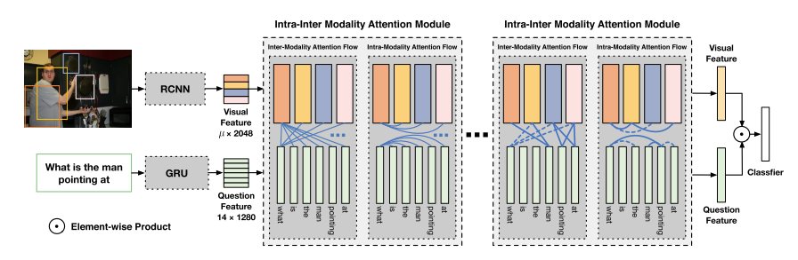

# DFAF.pytorch
A pytroch implementation based on [Dynamic Fusion with Intra- and Inter-modality Attention Flow for Visual Question Answering](https://arxiv.org/abs/1812.05252). Note that this is not a formal implementation from author's group, so there are some details different from original paper, for example, questions are padded and truncated to the different maximum length, lr decay strategy is different, but all the crucial parts are implemented by strictly following the paper's guide. If you found any bugs or codes that seem misunderstand the original paper, please let me know.

  

# Datasets 
Dataset is prepared based on [Cyanogenoid/vqa-counting](https://github.com/Cyanogenoid/vqa-counting/tree/master/vqa-v2) 

# Environments
- Python = 3.6 
- PyTorch >= 0.4

# Train & Eval
```
python train.py
```

# Setting:
All the settings are under config.py, including the path of dataset.
